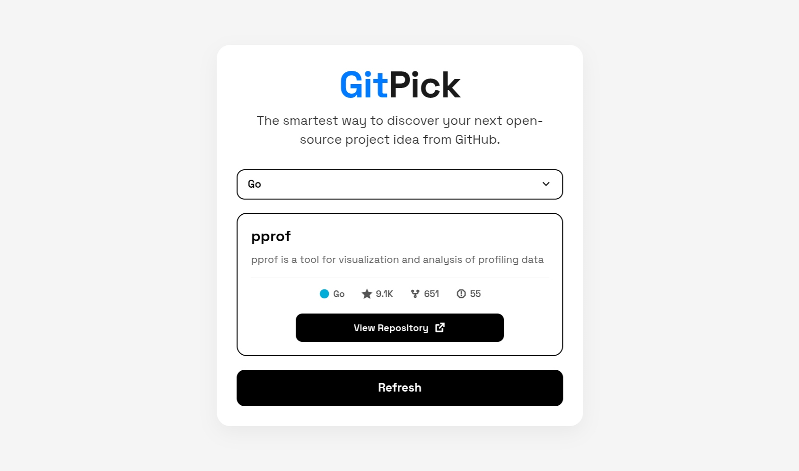
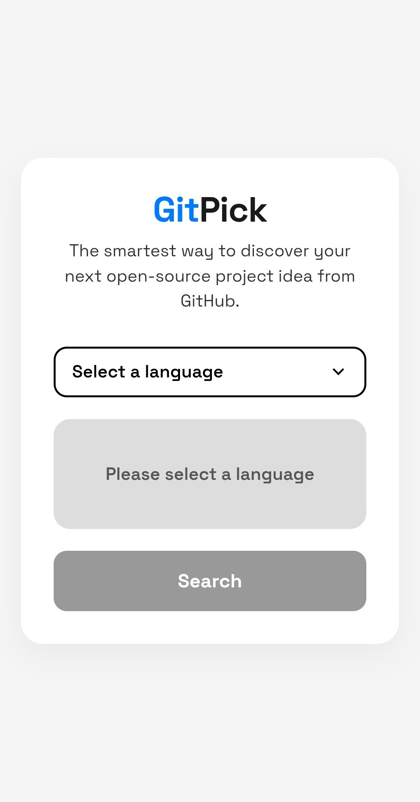
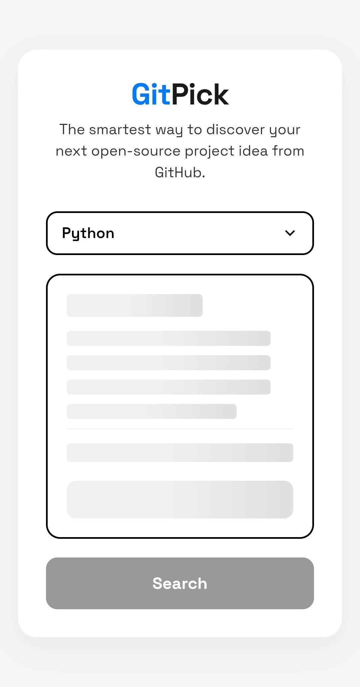
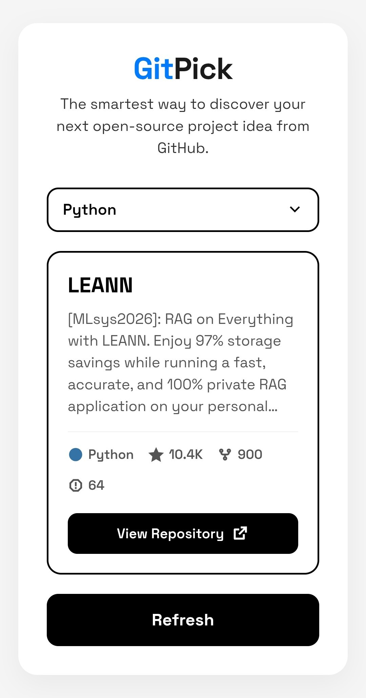
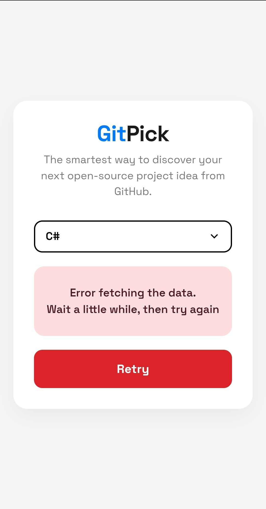

# GitPick

GitPick is a web-based application that helps developers discover interesting open-source projects on GitHub.  
It uses the GitHub Search API to provide a randomized selection of repositories based on a chosen programming language.

---

## ✨ Features

- **Language Filtering:** Select a programming language (e.g. JavaScript, Python, C, C++, etc.) to find relevant repositories.
- **Randomized Discovery:** Fetches a diverse range of repositories to encourage exploration of new projects.
- **Repository Insights:** Displays essential repository metadata such as:
    - ⭐ Stars
    - 🍴 Forks
    - 🐞 Open Issues
- **Responsive Design:** A clean, modern user interface optimized for both desktop and mobile devices.

---

## 📸 Interface Preview

| Desktop / Landscape View |
| :---: |
|  |

| Start Screen | Loading State | Success Result | Error Handling |
| :---: | :---: | :---: | :---: |
|  |  |  |  |

---

## 🛠 Tech Stack

- **Frontend:** HTML5, CSS3  
- **JavaScript:** ES6+ (Async / Fetch API)  
- **API:** GitHub REST API  
- **Icons:** Remix Icon

---

## 🚀 Getting Started

### Prerequisites

To run this project locally, you only need a modern web browser.

You can access the live project [here](https://jasseramir.github.io/gitpick/) or:

### Installation

1. Clone the repository:
   ```bash
   git clone https://github.com/jasseramir/gitpick.git
   ```
2. Navigate to the project directory:
    ```bash
    cd gitpick
    ```
3. Open ```index.html``` in your browser.

---

## 📁 Project Structure

> **Note:** This structure highlights the core files of the application.
> Additional assets are simplified for clarity.

```bash
GitPick/
├── index.html      // entry html file
├── README.md       // project documentation
├── LICENSE         // MIT license
├── screenshots/    // preview images
└── assets
    ├── scripts
    │   ├── main.js           // entry point
    │   ├── data.js           // fetch logic
    │   ├── ui.js             // rendering
    │   ├── utils.js          // helper functions
    │   └── colors.js         // language colors
    ├── styles
    │   ├── base.css          // global styles & variables
    │   ├── select.css        // select element styling
    │   ├── card.css          // card layout & states
    │   ├── buttons.css       // buttons styling
    │   └── responsive.css    // responsive design
    └── images/               // project images & icons
```

### 📄 File Descriptions

- **index.html**  
  The main entry point of the application.  
  Defines the structure and layout of the user interface.

- **styles.css**  
  Handles all styling and visual design.  
  Includes layout, colors, and responsive behavior.

- **script.js**  
  Contains the core logic of the application.  
  Manages API requests, data processing, and DOM updates.

---

## ⚠️ Notes

• GitHub API has rate limits for unauthenticated requests.
If you exceed the limit, the app may temporarily stop working.

---

## 📃 Licence

This project is licensed under the **MIT** License.